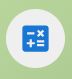

<!--
  +-------------------------------------------------------------+
  ! This file is part of oeTaskReport and based on the          !
  ! README.md template available on Github:                     !
  ! https://github.com/othneildrew/Best-README-Template         !
  +-------------------------------------------------------------+
-->

<!-- PROJECT LOGO -->
 

  
  <h3>OeTaskReport
   
  V 1.2.2</h3> 
  

  A standalone and freeware application which allows to <strong>report activities</strong>.
  

  

<!-- TABLE OF CONTENTS -->

  
Table of Contents

  <ol>
    <li>
      <a href="#about-the-project">About The Project</a>
      <ul>
        <li><a href="#built-with">Built With</a></li>
      </ul>
    </li>
    <li>
      <a href="#getting-started">Getting Started</a>
    </li>
    <li><a href="#usage">Usage</a></li>
    <li><a href="#license">License</a></li>
    <li><a href="#contact">Contact</a></li>
  </ol>

<!-- ABOUT THE PROJECT -->

## About The Project

**OeTaskReport** is a free program that allows you to easily build activities reports.
 
It has been developed by
<a href="https://ouestadam.com" target="_blank">Denis ESTEVE</a> (OUESTADAM-ESTEVE Freelance company).
 
It's a **standalone software** which doesn't require any additional product and any Internet connection.
 
This application supports, today, two languages selectable interactively: English and French.
 
This program comes with **ABSOLUTELY NO WARRANTY**. This is free software, and you are welcome to redistribute it
under certain conditions following the **GNU General Public License version 3 (or later)** available on following Website:
<a href="https://www.gnu.org/licenses/" target="_blank">GNU GPL License</a>

(<a href="#readme-top">back to top</a>)

### Built With

This application is built with

* [![React][React.js]][React-url]
* [![Electron Forge][Electron.js]][Electron-url]
* [![MUI Material][Mui.js]][Mui-url]

(<a href="#readme-top">back to top</a>)

<!-- GETTING STARTED -->

## Getting Started

This application has been developed for **Windows 10/11**, for **Linux Debian/Ubuntu** and for **Linux Redhat/Centos**.
 
**You will find installers on the <a href="https://ouestadam.com/freeware" target="_blank">Denis ESTEVE's Freeware Web page</a>.**

(<a href="#readme-top">back to top</a>)

<!-- USAGE EXAMPLES -->

## Usage
### Configure the application
At the first use, the application starts directly by opening the configuration window.
 
You could modify, at any time, the configuration by clicking on:

  
The configuration window allows :
<ol>
<li>To define the folder where the data will be stored.</li>
<li>To enter the list of clients.</li>
<li>To enter for each client the list of associated tasks.</li>
</ol>

### Start a task
When you start working on a task, you have just to select the client and the associated task,
 
then to click on **'START THE TASK'**.
 
Once the task is started, you could close the application, or power off the computer.
 
There is no impact on the task duration which is calculated with the system clock.
 

### End a task
When you have ended working on a task, you have just to click on **'END THE TASK'**
 
then you could choose if you record or not the time passed on this task.

### Build a report
For building a report, you have to click on:

 
You could build a report for one specific month or for the complete year.
 
You could build a report for all the clients or just for one client.
 
For a monthly report, you could request a detailed report which all worked days listed.
  
Then you could **'COPY'** in the Clipboard for pasting it in another application like EXCEL.
 
You could, also, generate a **.CSV** file for importing it on a spreadsheet application.

(<a href="#readme-top">back to top</a>)

<!-- LICENSE -->

## License

Distributed under the GNU General Public License version 3 (or later).
 
See `LICENSE.txt` for more information.

(<a href="#readme-top">back to top</a>)

<!-- CONTACT -->

## Contact

  

 
This application has been developed by <strong>Denis ESTEVE</strong> (OUESTADAM-ESTEVE Freelance company).
 
Feel free to consult his dedicated Website :
<a href="https://ouestadam.com" target="_blank">https://ouestadam.com</a>

(<a href="#readme-top">back to top</a>)

<!-- MARKDOWN LINKS & IMAGES -->
<!-- https://www.markdownguide.org/basic-syntax/#reference-style-links -->

[React.js]: https://img.shields.io/badge/React-20232A?style=for-the-badge&logo=react&logoColor=61DAFB
[React-url]: https://reactjs.org/
[Electron.js]: https://img.shields.io/badge/Electron-2B2E3A?style=for-the-badge&logo=vuedotjs&logoColor=4FC08D
[Electron-url]: https://www.electronforge.io/
[Mui.js]: https://img.shields.io/badge/Material%20UI-007FFF?style=for-the-badge&logo=vuedotjs&logoColor=4FC08D
[Mui-url]: https://mui.com/material-ui/
